#Introduction:  { .intro}

In this project you will use the the Sense HAT as a compass to navigate out of a maze of colourful rooms. You will need to point the Sense HAT in the direction you want to move and then press the button in the middle of the joystick to make a move. 

<iframe src="https://trinket.io/embed/python/79ac6a377d?outputOnly=true&start=result" width="600" height="500" frameborder="0" marginwidth="0" marginheight="0" allowfullscreen>
</iframe>
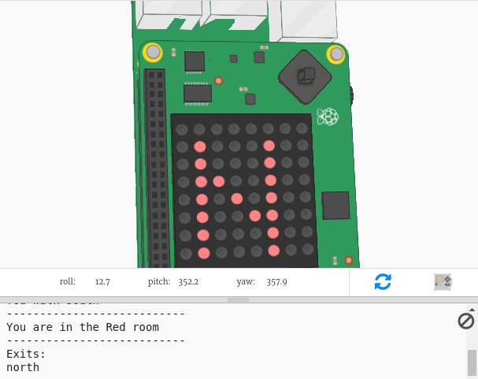

To play the game press Run and read the text that appears in the trinket output window.

Your current compass direction will appear on the Sense HAT display (N, S, E or W.) You can change direction by moving the Sense HAT in the emulator. 

When you are facing in the direction you want to go, press the middle button on the joystick by pressing enter on the keyboard. 

#Step 1: Finding the compass direction{ .activity}

The Sense HAT contains a magnetometer that can be used to work out which direction is North. 

## Activity Checklist { .check}

In the emulator North corresponds to the top of your screen. The Sense HAT reports a compass heading in degrees from North. 

Here's a reminder of the points of a compass:

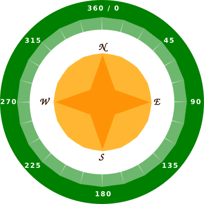

+ Open the Compass Maze Starter Trinket: <a href="http://jumpto.cc/compass-go" target="_blank">jumpto.cc/compass-go</a>. 

+ Let's find out which direction the Sense HAT is pointing in. Add the following code to the bottom of `main.py`:
    
    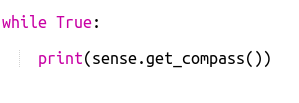
    
+ Run your code to see the compass heading - how many degrees you are from facing north.  

    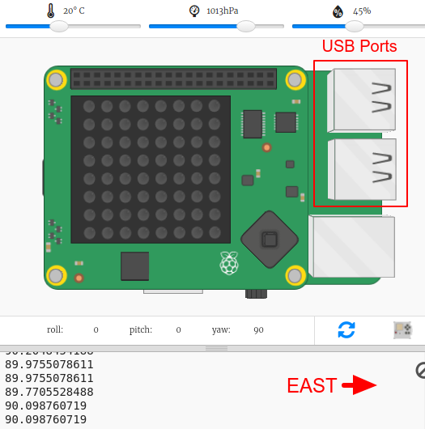
  
    In its starting position the Sense HAT is facing east and you should see values of about 90 degrees. 
    
    The direction is based on the USB ports. 
   
+ Drag the Sense HAT around to change its direction. 

    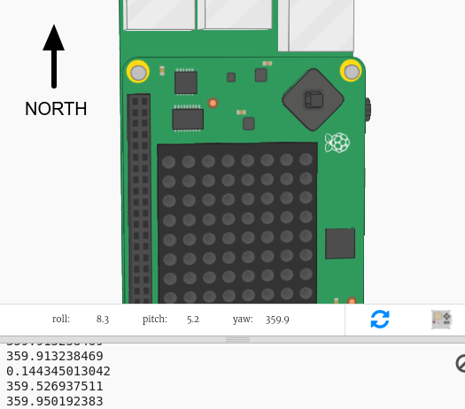
    
    Try finding different directions:
    
    + North: Around 360 or 0 degrees  
    + East: Around 90 degrees
    + South: Around 180 degrees
    + West: Around 270 degrees

       
+ If you get in a muddle you can always click the reset button to put the Sense HAT back into its starting position. 

    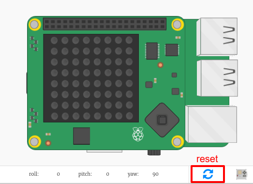

#Step 2: Showing the compass direction{ .activity}

Next let's show the compass direction, N, E, S or W, on the Sense HAT screen. 

If the compass heading in degrees is between 315 and 45 then the Sense HAT is pointing North and you want to display an N. If the heading is between 45 and 135 then you want to display an E and so on. 

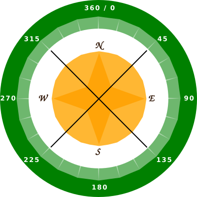

## Activity Checklist { .check}

+ First let's show an N on the screen when the Sense HAT is facing north. 

    Remember that when the Sense HAT is facing North the USB ports are at the top:

    
    
    Change your code code to display an 'N' when the compass heading is between 45 and 135:

    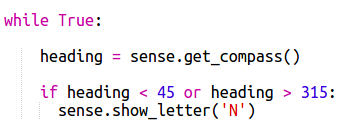
    
+ Drag the Sense HAT to North (USB ports at the top of the screen) to test your compass. 

    

The 'N' won't disappear, you need to add code for the other directions. 

+ Hmm, the 'N' is sideways. It would make more sense to have the letter facing in the same direction as the USB ports. 

Add the following code to rotate the Sense HAT display. 

    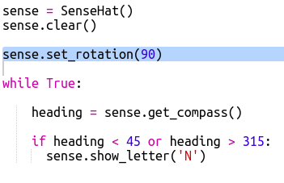
    
+ Now let's show an E on the screen when the Sense HAT is facing east. If you're not facing north then the heading must be more than 45 degree so you can just check that it's less than 135:

   
   
+ Add the code for south. Look at the compass to work out what the condition needs to be. 

+ Your code should look like this:

   

+ Now add th code for west. If it's not north, east or south then it must be west! You can just use an 'else'.

  

+ Test your code by dragging the Sense HAT around. 

    You've made a Sense HAT compass!
    
 
    

#Step 3: Navigating the maze { .activity}

Now let's use the compass to navigate around a maze.  

## Activity Checklist { .check}
    
+ The code for creating a simple adventure game (like the one in the RPG project) is in maze.py in your project. 

    You'll need to import `maze.py` to use it:

    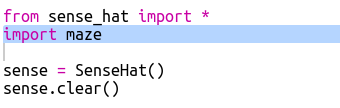
    
    `maze.py` includes some functions to help you write a maze game:
    
    + `maze.start()` - starts the game
    + `maze.escaped()` - tells you whether the player has escaped the maze
    + `maze.walk(dir)` - moves the player in the given direction  
    
+ Start the game with `maze.start()`:

    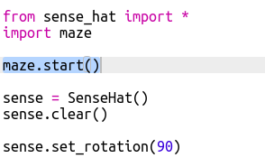
    
#Step 4: Add colours { .activity}
It would be better if you could tell which room you were in just by looking at the Sense HAT. 

Let's display the compass letter in the colour of the current room. 

If you're in the Blue room and facing South you should see a blue letter S.

## Activity Checklist { .check}

+ First create a dictionary of colours for the rooms. 

   
   
+ Now use the colour of the current room when you display the compass letter:

   
   
+ Test your code and you should find that you can tell which room you're in from the colour of the letter. 
 
## Challenge: Reward the player

Can you reward the player with a cool display on the Sense HAT when they manage to escape? 
 
## Challenge: Create your own maze { .challenge}

Create your own colourful maze and get a friend to try and find their way out. 

    You'll need to:

    + Edit the rooms dictionary in maze.py
    + Add new colours the colours dictionary

