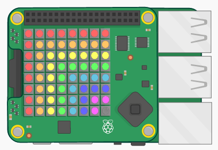
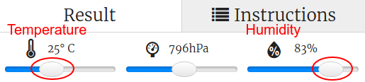
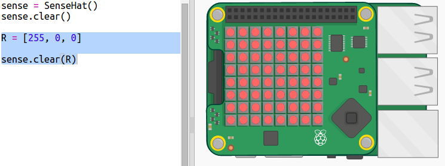
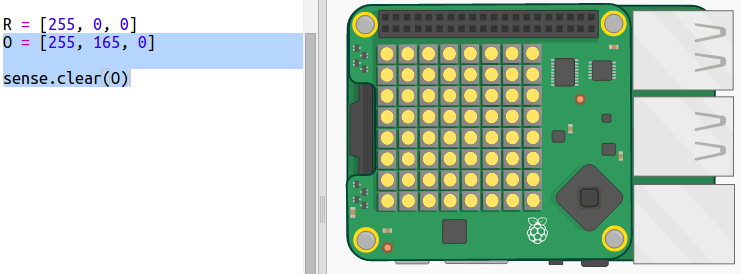
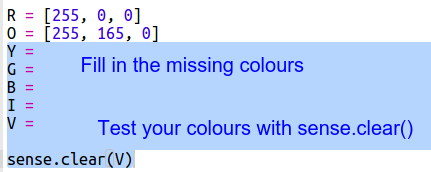
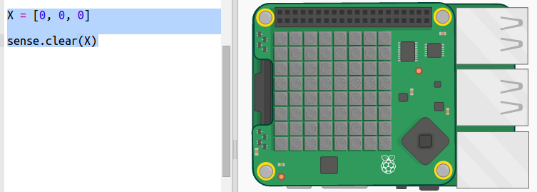
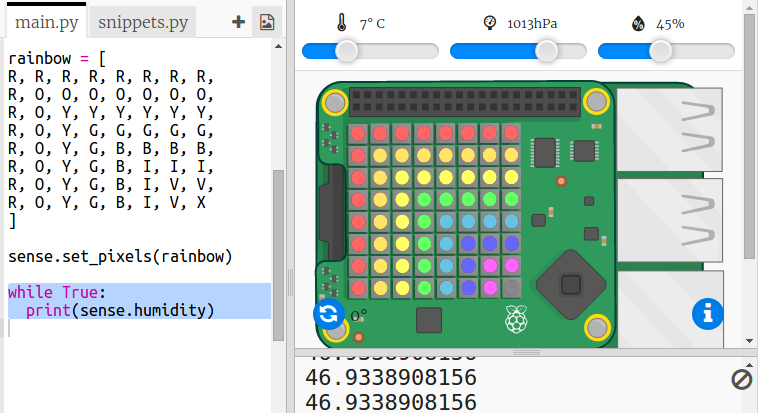
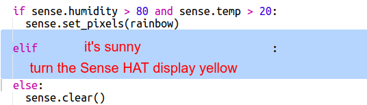
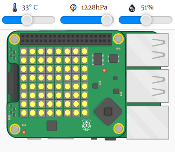
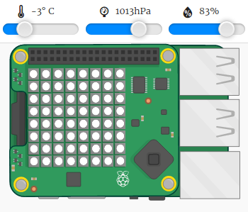

#Introduction:  { .intro}

In this project you will use the temperature and humidity sensors on the Sense HAT to predict when there’s a good chance of spotting a rainbow. When the right conditions are detected you will display a rainbow on the Sense HAT LED Matrix. 

<iframe src="https://trinket.io/embed/python/eaea4cb76c?outputOnly=true&start=result" width="600" height="500" frameborder="0" marginwidth="0" marginheight="0" allowfullscreen>
</iframe>

In the Trinket emulator you can move the sliders to change the temperature and humidity, they look like this:

 

You'll get a rainbow if the temperature is over 20 degrees C and the humidity is over 80 percent. Try experimenting to find the weather conditions for sunshine (yellow) and snow (white).  

#Step 1: Drawing a rainbow { .activity}

First let's draw a rainbow using the LED Matrix on the Sense HAT. The colours are Red, Orange, Yellow, Green, Blue, Indigo and Violet.

To set the colour of an individual LED we need to say how much red, green and blue it should have from 0 to 255. 

## Activity Checklist { .check}

+ Open the Rainbow Predictor Starter Trinket: <a href="http://jumpto.cc/rainbow-go" target="_blank">jumpto.cc/rainbow-go</a>. If you're reading this online, you can also use the embedded version of this Trinket below. 

<iframe src="https://trinket.io/embed/python/6e4cb01c6b?start=result" width="100%" height="400" frameborder="0" marginwidth="0" marginheight="0" allowfullscreen></iframe>

    The code to set up the Sense HAT has been included for you. 

+ Add the highlighted code to set up a variable for the colour Red and then turn all the pixels red using `sense.clear(R)`:

    
    
    Make sure you use a capital letter `R`. 
       
+ Orange is next. Orange is red mixed with green. You can adjust the numbers until you get an orange that you like. Make sure you use a capital letter `O` not a number zero. Use `sense.clear(O)` this time to test the new colour. 

    

+ Now add variables `Y`, `G`, `B`, `I`, `V` so that you have the seven colours of the rainbow. You can look up RGB colours at <a href="http://jumpto.cc/colours" target="_blank">jumpto.cc/colours</a>

    You can test your colours using `sense.clear()`.
    
    

+ Add a variable `X` for setting pixels to off (no red, green or blue):

    

+ Now it's time to draw a rainbow. You need to set up a list containing the colour of each pixel and then call `set_pixels` with the list of colours. To save typing you can copy the rainbow from `snippets.py` in your project. 

    

#Step 2: Reading the sensor data { .activity}

The Sense HAT has a range of sensors that provide real world data on a Raspberry Pi computer. The Sense HAT Emulator in Trinket allows you write and test projects for the Sense HAT in your web browser. 

The humidity sensor reports the amount of moisture in the air. Humidity is high when it rains. 

## Activity Checklist { .check}

+ Let's read from the humidity sensor and print out the result. Add the highlighted code to the bottom of your script.

    

+ Test your program by moving the humidity slider to different values. 

   

   Notice that the value you get back from the humidity sensor isn't exactly the same as the value on the slider. This is because the sensors aren't perfectly accurate.  
    

#Step 3: Predicting a rainbow { .activity}

Rainbows happen when the sun shines through water droplets at the right angle (usually in the afternoon.) If it's warm and the humidity is high then it's worth checking to see if there's a rainbow. 

## Activity Checklist { .check}

+ Now let's only show the rainbow if the conditions are right. Change your code to look like this:

    

    You can't be sure there's a rainbow when these conditions are met, but it's worth a look.   
    
+ Try changing the values on the slider until you see the rainbow. 

    

    Remember that the values reported won't be exactly the same as those shown on the sliders. 
    
+ A *threshold* is a number that indicates an important change. 20 degrees C and 80% humidity are thresholds for the rainbow detector. 

    Try changing the thresholds and then moving the sliders to trigger a rainbow.  
    
    If you're working with a physical Sense HAT then you can test your code by setting the thresholds to low values. 

 
## Challenge: More Weather { .challenge}

Can you display a sun image when the temperature is above 20 and the humidity is below 80%. 

Tip: Use `elif` to check for other kinds of weather. For each kind of weather you'll need to include a condition to check for a kind of weather and then code to set the display on the Sense HAT.

Tip: You can create a simple sun by setting all the pixels to yellow with `clear()`. Or you can try creating a pixel image like you did with the rainbow. 

How about a snow image if the humidity is above 80% and the temperature is below zero.

Tip: Set red, green and blue to the maximum of 255 to create white. 

