#Introduction:  { .intro}

In this project you will create a game in which you have to tilt your Sense HAT to guide a character along a path. If you fall off the path, you have to start again from the beginning!

You will be writing code in the Python programming language, which you may have learnt in the [Python module](../../python/).  

<iframe src="https://trinket.io/embed/python/790adaa749?outputOnly=true&start=result" width="600" height="500" frameborder="0" marginwidth="0" marginheight="0" allowfullscreen>
</iframe>
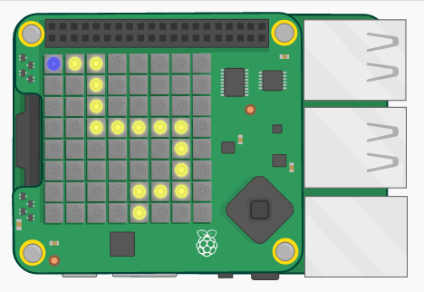

  

#Step 1: Draw a path { .activity}

First let's draw the path that your character must follow.

## Activity Checklist { .check}

+ Open the Tightrope Starter Trinket: <a href="http://jumpto.cc/tightrope-go" target="_blank">jumpto.cc/tightrope-go</a>.

    __The code to set up the Sense HAT has been included for you.__

+ Let's start by creating variables to store the colours you want to use. Remember that to set the colour of an individual LED, you need to say how much red, green and blue it should have.

	To create yellow, you'll need maximum red and green, and no blue:

	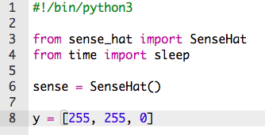

	(If you prefer, you can go to [jumpto.cc/colours](http://jumpto.cc/colours) and choose any colour you like!

+ You'll also need black pixels (or any colour you like) around the path.

	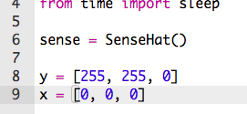

+ To draw your path, you first need to create a list containing the colour of each pixel.

	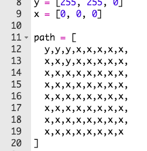

    __To save typing, you can copy the code from `snippets.py` in your project.__

	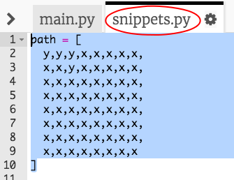

+ Next, you need to call `set_pixels` to display your path image on the Sense HAT.

	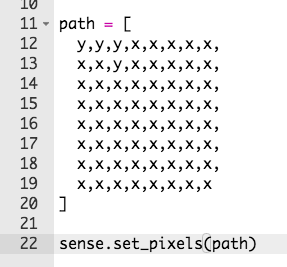

+ Click 'Run' to test your code. You should see a yellow pixel in the places that you've used your `y` variable, and no colour in the places that you've used `x`.

	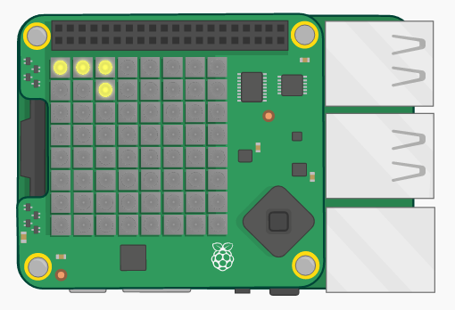

## Challenge: Create your own path { .challenge}
Can you edit your `path` variable to create a path to follow?

__Make sure that your path starts at the top-left of the display.__

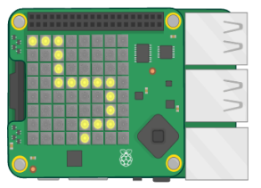

#Step 2: Draw your player { .activity}

Let's add the character to your game.

## Activity Checklist { .check}

+ First, create another colour variable for your character. Here's how to create blue:

	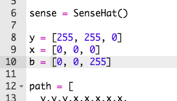

+ Next you need to create variables to store your character's x and y position. To start with, we'll set these both to `0`, which is the top-left of the Sense HAT.

	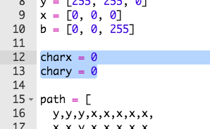

+ To display your character, use `set_pixel`. You need to tell `set_pixel` the x and y position of the pixel to set, as well as the colour.

	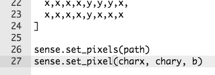

+ Test your code, and you should now see your character in the top-left of the screen.

	

#Step 3: Roll, pitch and yaw { .activity}

You'll be tilting the Sense HAT to move your character. Let's start by finding out the __orientation__ (the position) of your Sense HAT.

## Activity Checklist { .check}

+  The Sense HAT can detect its __roll__, __pitch__ and __yaw__.

	

+ Try dragging the Sense HAT to change its roll, pitch and yaw values to see how it moves.

	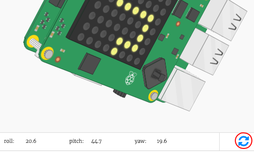

	__Press the reset button to put the Sense HAT back to the starting position when you've finished testing.__

+ We only need the pitch and the roll for this project, so add 2 lines of code to get these values from the Sense HAT.

	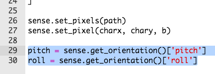

+ Print the pitch and roll to test them out.

	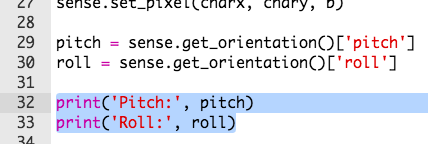

+ Run your code to test it, and change the pitch of the Sense HAT to tilt it to the right. You'll notice that the printed `pitch` value doesn't change!

	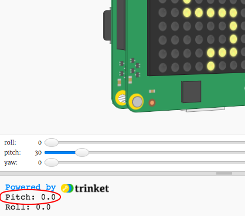

+ The problem is that you are only getting and printing the `pitch` and `roll` __once__.

	To do this repeatedly, you'll first need to indent all of your code for setting the pixels, as well as getting and printing the `pitch` and `roll` values.

	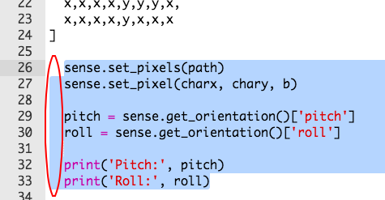

+ You can then add `while True:` above the indented code to run it forever.

	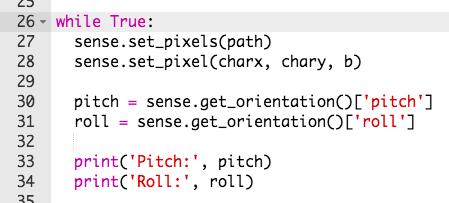

+ Test your code again, and this time you should see the printed `pitch` value change.

	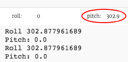

#Step 4: Moving the character { .activity}

Now let's move your character when the Sense HAT is tilted.

## Activity Checklist { .check}

+ Let's move your character to the right if the Sense HAT's `pitch` is between `270` and `315` degrees.

	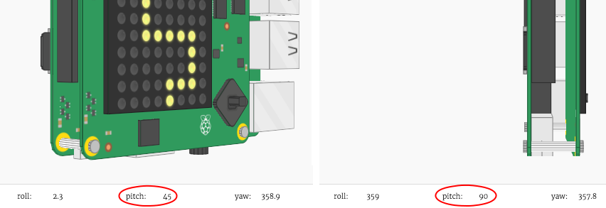

+ Add this code to change the character's x position if the pitch is between `270` and `315`:

	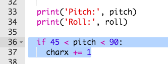

	__Make sure that this code is indented, so that the character moves repeatedly if the Sense HAT is tilted.__

+ Tilt your Sense HAT so that the `pitch` is between `270` and `315` degrees. You should see that your character moves to the right, but keeps going off the display!

	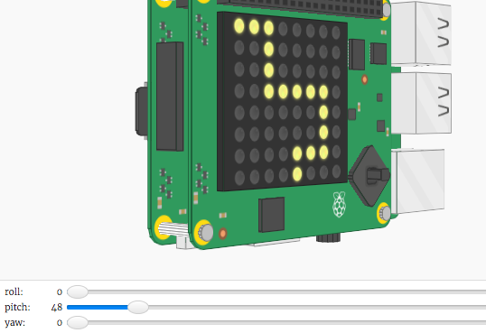

	You will also see an error, because the character's x position goes above 7, which is not a valid position on the display.

	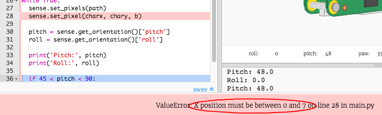

+ To fix this, you only want to move your character to the right if its current position is less than 7.

	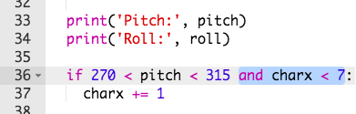

+ Test your improved code, and you should now see that your character moves __until it gets to the right side of the display__.

	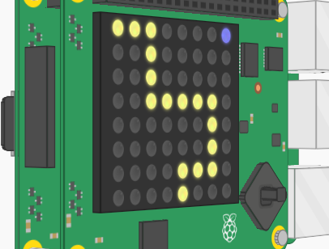

+ We also want to move your character to the left when the `pitch` is between `45` and `90` degrees.

	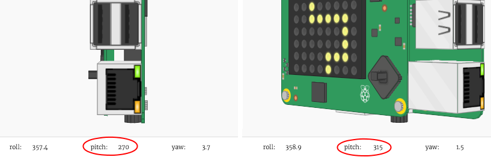

+ Add this code to move your character to the left if the `pitch` is between `45` and `90`, but __only if the character isn't already at the far left of the display__.

	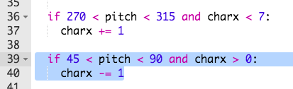

+ Test your code to make sure that you can tilt your character back to the left.

+ Next, let's add code to change your character's __y-position__, moving it down when the __`roll`__ value is between `45` and `90`.

	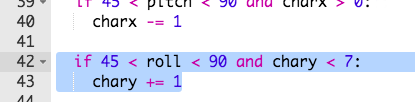

+ test this code to see if you can tilt the Sense HAT to move your character down.

	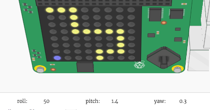

+ If you want to slow your game down, you can add short `sleep` at the end of your `while True:` loop.

	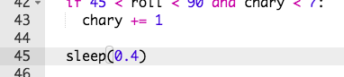

## Challenge: Moving up! { .challenge}
Can you add code to move your character up (by changing your `chary` variable by `-1`) when the `roll` is between `270` and `315`?

The code you'll need to add will be __very__ similar to the code for moving your character to the left.

#Step 5: Going back to the start { .activity}

Let's put your character back to the start when it falls off the path.

## Activity Checklist { .check}

+ You may have noticed that nothing happens when the character falls off the path.

	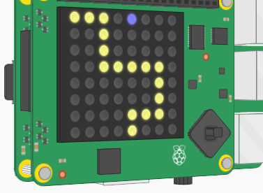

+ To fix this, we're going to send the character back to the start if they're standing on a black pixel.

	Let's start by getting the colour of the pixel the character has moved to.

	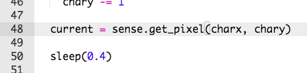

+ If the colour of the current pixel is black, then send the character back to the start.

	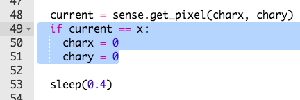

+ Test your code and you should see your character move back to the start if they fall off the path.

## Challenge: Changing the difficulty { .challenge}
Ask some friends to test your game. Did they find it too easy or too hard? If so, you could make some changes:

+ Change the path the character has to follow;
+ Change the `pitch` and `roll` values that move your character;
+ Add a short or longer `sleep` at the end of your loop.

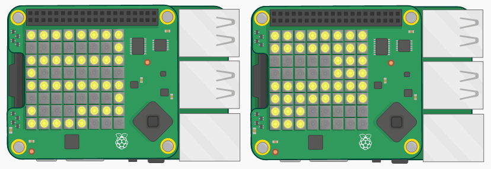
