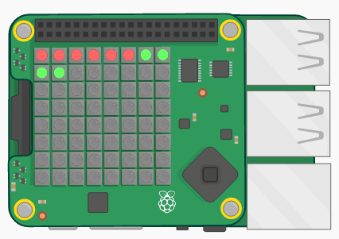
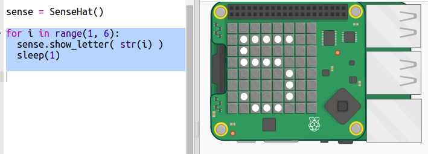
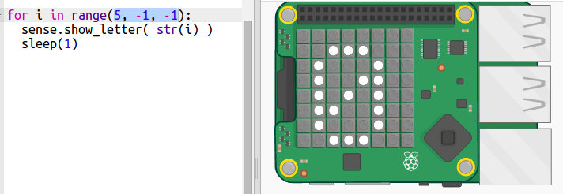
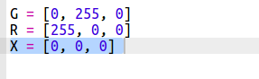
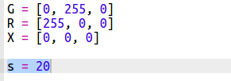

#Introduction:  { .intro}

In this project you will use coloured pixels on the Sense HAT to display a countdown timer.  

You will be writing code in the Python programming language, which you may have learnt in the [Python course](../../python/).  

<iframe src="https://trinket.io/embed/python/dfdfcc6814?outputOnly=true&start=result" width="600" height="500" frameborder="0" marginwidth="0" marginheight="0" allowfullscreen>
</iframe>

  

#Step 1: Text countdown { .activity}

First let's countdown from 5 to 0 by displaying numbers using the pixels.  

## Activity Checklist { .check}

+ Open the Countdown Timer Starter Trinket: <a href="http://jumpto.cc/timer-go" target="_blank">jumpto.cc/timer-go</a>. If you're reading this online, you can also use the embedded version of this trinket below.

    __The code to set up the Sense HAT has been included for you.__

<iframe src="https://trinket.io/embed/python/b328848f53?start=result" width="100%" height="400" frameborder="0" marginwidth="0" marginheight="0" allowfullscreen></iframe>

 

+ First you're going to count up to 5 because that's easier. Add the highlighted code to the bottom of your script:

    
    
    `sense.show_letter()` displays a single letter on the Sense HAT. It doesn't allow numbers so you have to use `str` to change the number.  
    
    `sleep(1)` waits one second before carrying on. 
     
       
+ In Python, range(1, 6) returns the numbers 1 to 5. You don't have to count in ones though:

    - range(1, 10, 2) would could up in twos giving 1, 3, 7, and 9. 
    - range(5, 0, -1) counts down by taking away -1 giving 5, 4, 3, 2, 1
    
    Change the range in your code so that it counts down to 0:

    
    
+ The number doesn't have to be white, the Sense HAT can display lots of colours. It uses RGB colours, try using green:

    
    
    
## Challenge: Another colour { .challenge}
    
Can you change the colour to one you like? 

Here's another example that uses the colour red:

    
Try experimenting with the R, G and B values (from 0 to 255.) What colour is `[255, 0, 255]`?

You can also look up the RGB values for a colour using <a href="jumpto.cc/colours" target="_blank">jumpto.cc/colours</a>. 
    
    
#Step 2: Creating a dot timer { .activity}

Another way to create a timer is by turning pixels from green to red.  

## Activity Checklist { .check}

+ Duplicate your project to create a new project. 

    
    
    If you don't have an account, click 'Share' and save a link to the current project then carry on editting it. 
    
+ Call the new project 'Dot Timer'.
    
+ Keep the `R` and `G` colour variables but delete the `for` loop code. Add a variable X to use to turn pixels off - it has no red, green or blue:

    
 
    
+ Add a variable called `s` for the number of seconds you want to count. 

   

+ You can give the Sense HAT a list of 64 (8 x 8) colours to display starting from the top left and working down a row at a time.

    Let's create a list of colours by creating a green dot for each second we want to count, and setting the rest of the 64 pixels to off. The `timer` variable contains the list of colours to display and starts off empty:
    
    

+ Now let's run the countdown by turning a dot red every second:

    
    
+ And how about flashing the display __at the end__, by turning the pixels on and off:

    

## Challenge: Timer games { .challenge}

Can you create a timer for a game or challenge. Try duplicating one of your timers and changing it. Will your timer need to count up or down, can you change the colours?

Use your timer to challenge a friend. One of you should watch the timer while the other completes the challenge. 

Use one of these ideas or come up with your own:

+ Can you recite the alphabet in 5 seconds? What about backwards?

+ How many times can you type Code Club in 10 seconds?

+ Gather together a few classroom items such as erasers and pencils. You get 20 seconds to try and memorize them all. Then you close your eyes while your partner removes an object. Can you identify the missing object in 10 seconds? 

