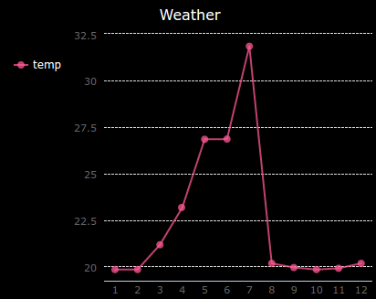
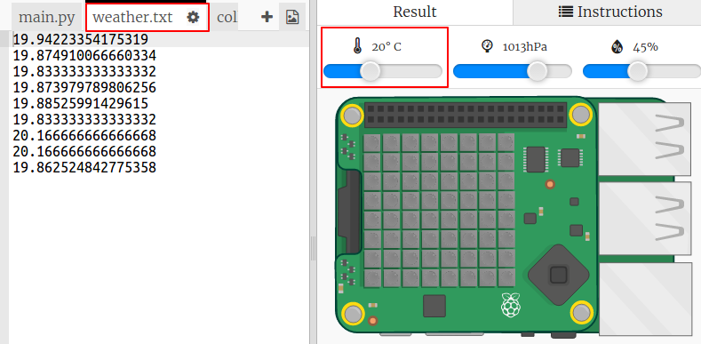
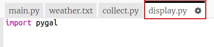

#Introduction:  { .intro}

In this project you will collect data from the Sense HAT's sensors and log it to a file. Then you will use the PyGal module to display that data as a line graph. 

You will be writing code in the Python programming language, which you may have learnt in the [Python module](../../python/).

<iframe src="https://trinket.io/embed/python/5e246d8212?outputOnly=true&start=result" width="600" height="500" frameborder="0" marginwidth="0" marginheight="0" allowfullscreen>
</iframe>

#Step 1: Logging the temperature { .activity}

First let's log the temperature to a file every 5 seconds. You can use the emulator to change the temperature. 

## Activity Checklist { .check}

+ Open the Weather Logger Starter Trinket: <a href="http://jumpto.cc/weather-go" target="_blank">jumpto.cc/weather-go</a>. 

    __Some files and code have been added for you.__
    
+ Click on `collect.py`. This is where you'll write the code to collect the temperature data. Let's open the `weather.txt` file and write the temperature to it every five seconds.

    Add the highlighted code to `collect.py`:

    
    
    Opening the file with `a` means that data will be appended to the end of the file.  
       
    Writing a newline character `\n` puts each temperature reading on its own line. 
    
+ Click on `weather.txt`. It should be empty. This is where the data will be stored. 

    

+ Now click Run. Use the temperature slider on the emulator to change the temperature. You should see the temperature reading added to the end of `weather.txt` every five seconds. 

    Remember that the emulator tries to behave like a real Sense HAT so you won't see exactly the same reading even if you don't change the emulator. 
    
    

+ Click the square `Stop` button when you have finished collecting data. 

    

+ You can highlight the data in `weather.txt` and delete it if you want to start collecting new temperature data. Collect around 10 temperature readings.         
       

#Step 2: Creating a temperature graph{ .activity}

Now you've collected some temperature data let's show it on a line graph. 

## Activity Checklist { .check}

+ Click on `main.py`. At the moment it imports the `collect.py` script that you wrote to collect the temperature data. Now change it so that it imports the `display.py` script instead. 

    Comment out the `import collect` line by adding a `#` at the beginning and remove the `#` from the beginning of the `import display` line. 
    
    `main.py` should now look like this:
    
       

+ Click on `display.py` to work on the code for displaying the data. You'll be using the Pygal library which has been included for you. 

    

+ Add the highlighted code to read the values from the `weather.txt` file into a list called `temp`.  

    
    
+ Run the code to see the values printed out. You can remove the `print` line when you have tested your code.

+ Now let's add the code to create a line graph from the data using Pygal.   
    
    
   
+ Pygal automatically creates labels for the y axis from the data. Let's add a title and labels for the x axis. We can number the readings starting from 1. We need to add one to the length of the temperature list so that range will return a list of numbers that goes from 1 up to the length of the list. 

    Add the highlighted code to add a title and labels:
    
    
    
    
## Challenge: Simulate different weather conditions { .challenge}

Can you collect and display weather for different weather conditions? Try a hot summer's day where the temperature is over 30 degrees C and a cold winter where the temperature drops below freezing. 

Remember that you'll need to swap between including `collect` and `display` in `main.py`. 

You can just highlight and delete the data in `weather.txt` to clear the data. Or you could create new files to store different readings. 

 
## Challenge: Record humidity or pressure { .challenge}

 Humidity is high when there is a lot of moisture in the air. High pressure is associated with fine weather while low pressure means cloudy, rainy or snowy weather. 

Duplicate your project and change it so that it records humidity or pressure instead of temperature.

