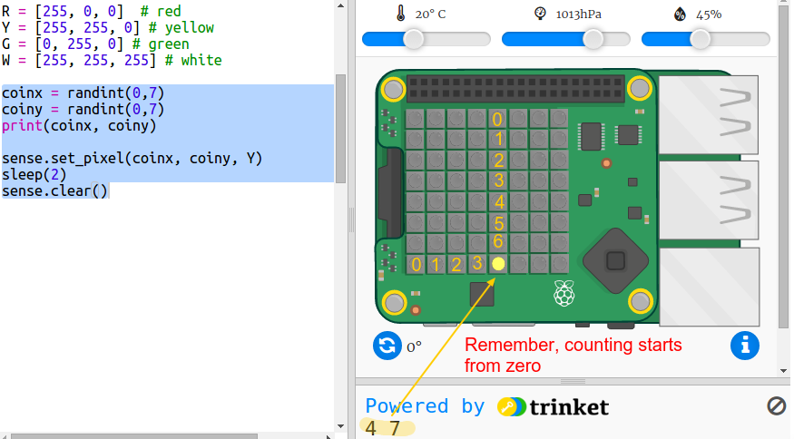
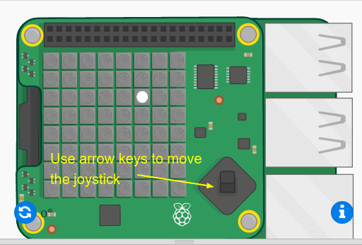
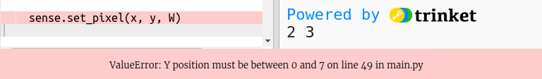
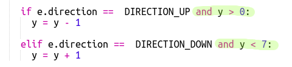
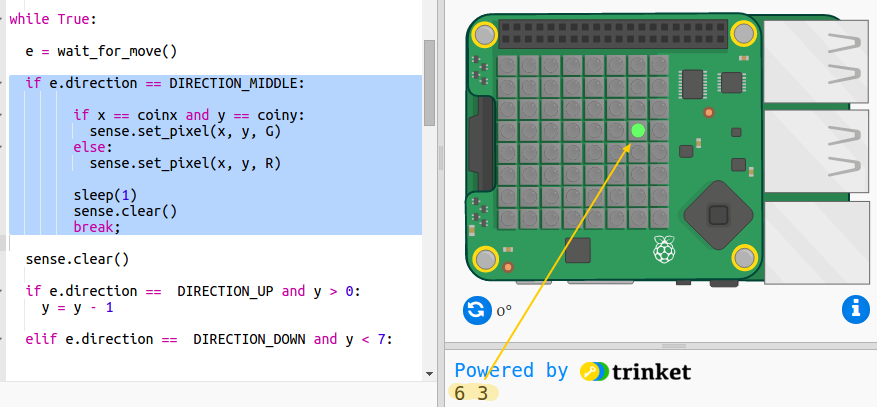
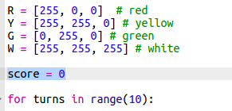

#Introduction:  { .intro}

In this project you will use the joystick and LED Matrix on the Sense HAT to play a memory game. The Sense HAT will show a gold coin and you have to remember where it was and use the joystick to find the hidden treasure.

You will be writing code in the Python programming language, which you may have learnt in the [Python module](../../python/).

<iframe src="https://trinket.io/embed/python/79ac6a377d?outputOnly=true&start=result" width="600" height="500" frameborder="0" marginwidth="0" marginheight="0" allowfullscreen>
</iframe>

To play the game press Run and watch to see where the yellow dot appears - this is the treasure! Then use the arrow keys on the keyboard to move the white dot to where you think the treasure is hidden. When you get there, press return. You'll see a green dot if you were correct and a red dot if you got it wrong. You'll get 10 tries and then a score out of 10. 

Note that when you are using the Sense HAT emulator you use the arrow keys and return instead of the joystick on the Sense HAT. 

#Step 1: Hiding the treasure{ .activity}

First let's show a yellow coin at a random pixel and then hide it.  

## Activity Checklist { .check}

+ Open the Where's the Treasure? Starter Trinket: <a href="http://jumpto.cc/treasure-go" target="_blank">jumpto.cc/treasure-go</a>.

+ Take a look at the code that has been included for you. This sets up the Sense HAT and the libraries you will be using, and also includes some helper code so that you can get to the interesting stuff more quickly:
    
    

+ Let's display a yellow coin at a random location and then hide it. The `coinx` and `coiny` variables are the x and y coordinates of the coin. Go to the bottom of the script and add the following code:

    
    
    Make sure you use a capital letter `Y`. 
       
+ Run your code a few time to see the coin appear and disappear at random locations. 

#Step 2: Finding the treasure{ .activity}

Now let's show the player as a white pixel. You'll need to use the Sense HAT joystick to navigate to where you think the treasure is hidden. 

The physical Sense Hat has a mini joystick. You can see a picture of it in the emulator:

   
   
In the emulator you can use the arrow keys for the direction buttons on the joystick and Enter (Return) for pressing the middle button. 

## Activity Checklist { .check}

Now let's add a pixel that the player can move to where they think the treasure is hidden. The player is a white pixel.

+ Now display the player's location using a white pixel:

    
    
    `x` and `y` are the player's coordinates. 

+ Let's get the white pixel moving using the joystick. Every time the player presses one of the arrow keys on the joystick we need to clear the current pixel and draw one at the new location. Let's start by allowing the player to move in the y direction (up and down): 

    
    
+ Test your code by pressing the up and down arrows on the keyboard. 

    

    What happens when you reach the top edge and press up? 

    
    
    If the y position goes below 0 or above 7 then you'll get an error when you try and set the pixel colour. 
    
+ Let's add a check to make sure the pixel stays on the display:

   

+ Now let's add movement in the x direction. Add the highlighted code:

    

     
+ Once you have moved to the location where you think the treasure is hidden you need to press the middle button on the joystick. In the emulator you'll need to press Enter (Return) on the keyboard. 

    If the player is at the same location as the treasure then they've found it and the pixel goes green for 1 second. 
    
    If the player has picked the wrong location then the pixel goes red for 1 second.     
    
    
    
    `break` means we don't need to wait for more events after the player has chosen a location, we can stop repeating the loop.

#Step 3: Keeping score { .activity}

At the moment you only get one go at finding the treasure. Let's give the player 10 turns and keep a score. 

## Activity Checklist { .check}
    
+ Now you'll need a `for` loop to let the player have 10 goes at finding the treasure: 

    
    
+ In Python, code must be indented to be inside a loop. You don't need to indent the lines one at a time though! Highlight all of the code after the `for` loop then press the 'Tab' on the keyboard and it will all be indented. 

    
    
    Make sure all of the code after the `for` gets indented, right to the bottom of the code. 

+ Next add a score variable which starts at zero:

    
    
+ You'll also need to add one to the score when a player chooses the correct location:

    
  
+ And finally, let's display the score at the end. 

    
    
    Make sure there's no indentation before this code, it needs to run after the `for` loop has run 10 times and the game is finished. 
    
 + Now play the game. Can you score 10 out 10?
 
## Challenge: Customize the game { .challenge}

Try using different colours or showing a different message depending on how well the player did. 

## Challenge: Make it harder { .challenge}

Are you finding the game too easy? Why not make it harder. 

You could show the coin for less time. `sleep(2)` shows the coin for 2 seconds. What about `sleep(0.5)`?

Or how about confusing the player by making all the pixels turn yellow before they get to pick the location? Use `sense.clear(Y)` to fill the screen with yellow coins after showing the player where the coin is hidden, you'll also need `sleep(1)` or however many seconds you want to show the yellow screen for. 

